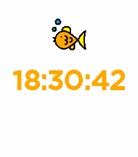

# Watchface Example

An Pebble watchface example that uses an image resource.

Build watchface:

```
$ zig build
```

Emulate watchface:

```
$ PEBBLE_EMULATOR=emery zig build upload
```

<table>
<tr>
<td>



</td>
</tr>
</table>

```
$ PEBBLE_EMULATOR=gabbro zig build upload
```

<table>
<tr>
<td>


</td>
</tr>
</table>

Fish image sourced from https://www.svgrepo.com/svg/256351/fish (licensed CC0).

Converted to PNG8 with `convert -scale 50x -background none fish.svg PNG8:fish.png`
